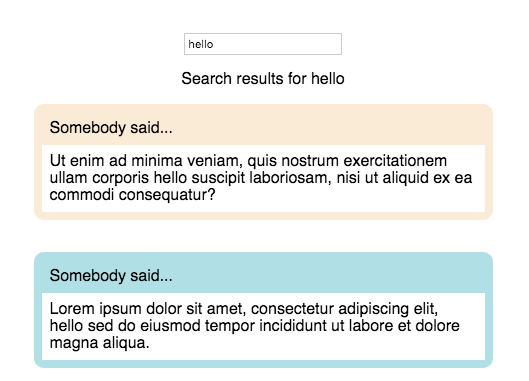
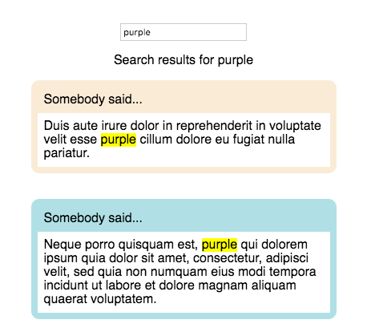

Have you noticed how search pages highlight your search terms in their results? Google bolds them, Facebook highlights these terms with a pale blue background colour, and Chrome highlights them in a typical highlighter yellow. I wrote the search results page for Kissflow that shows posts and cards most relevant to the search phrase, and in this blog post I’ll explain how I went about highlighting the search terms in the results.

We start with a React Component that has a search box, and renders search results with the Lorem Ipsum text. I’ve written a `getSearchResults` method that takes the search term as an argument and generates fake search results, each of which is a random sentence of the Lorem Ipsum text, with the search term thrown in at a random position.

<iframe src="https://codesandbox.io/embed/search-page-1-2w114?fontsize=14&hidenavigation=1&theme=dark" width="1032" height="1200" frameborder="0" scrolling="no"></iframe>

Here’s the [codesandbox](https://codesandbox.io/s/search-page-1-2w114).

The search box has an `onKeyDown` handler. If the `Enter` key was pressed, we set the `searchTerm` and get the `searchResults`. And in the `render` method, we loop through the `searchResults` and render the corresponding post for each search result.

### Why should we highlight search terms?

Here’s a picture of what the results page looks like:

<figure>



<figcaption>Looking for the word you searched for in the search results? It’d be easier if the search terms were highlighted.</figcaption></figure>

Did you spot something annoying in this page? I had to scan through the posts to spot the term I was searching for. If the search term in each post was highlighted, that’d make it easier for people to figure out how these posts are relevant to the search term.

I looked up libraries to highlight terms, and decided to use the [mark.js](https://markjs.io/) library, which highlights terms and has a variety of [customisable options](https://markjs.io/configurator.html). I wrote a `highlightSearchTerms` function that looked like this:

```js
highlightSearchTerms = (term, node) => {  
  let instance = new Mark(node);  
  instance.mark(term, {  
    separateWordSearch: true,  
    accuracy: "exactly"  
  });  
};
```

We create a new instance of Mark, which takes in a context, which can either be an element (like the return value of a `document.getElementById(...)`), or a string selector. I’ll be passing a string selector `"div.searchResultsList"`.

After creating a new instance, we call the `mark()` method, passing the search term and an options object as a parameter. [Check out this link to see what options are supported!](https://markjs.io/configurator.html)

By adding the `mark` selector to our CSS, we can style the highlighted terms however we want.

```js
mark {  
  background-color: yellow;  
  color: inherit;  
}
```

### When should we highlight search terms?

I thought I’d call the `highlightSearchTerms` method right after calling the `getSearchResults` method, but [as demonstrated here](https://codesandbox.io/s/search-page-2-dtvhk), this doesn’t work! This is because the posts take some time to render. When we call the `highlightSearchTerms` method right after we `getSearchResults`, the posts would not even have rendered, and `mark.js` would have nothing to highlight.

There was another problem: the search results page was an infinitely scrolling page that loaded more posts after scrolling to the end of the page ([using the IntersectionObserver API](https://medium.com/@saravananr_93203/infinite-scroll-in-react-made-easy-with-intersection-observer-33bdb5fa9cf6)), so I’d have to call the `highlightSearchTerms` function again, whenever more posts are rendered.

If only there was something that can notify us after the posts have been rendered, we’d be able to solve both these problems.

### MutationObserver API

Enter [the MutationObserver API](https://developer.mozilla.org/en-US/docs/Web/API/MutationObserver), which lets us watch the changes to the DOM tree, [and is supported on most browsers](https://developer.mozilla.org/en-US/docs/Web/API/MutationObserver#Browser_compatibility). A callback passed to the MutationObserver will get called whenever the DOM tree changes, so we get notified after the posts get rendered!

In `componentDidMount()`, we create an instance of the observer by passing a callback function to it. Then we can call the `observe()` method to watch for changes, passing the target node and a config object. Because we need to observe the `searchResultsList` div, I’m passing that as the target node. The config object specifies which mutations are observed: the options are `attributes`, `childList`, and `subtree`. Because we only need the observe the changes in the immediate children of the `searchResultsList`, I’m only adding in the `childList` option.

```js
let observer = new MutationObserver(mutationCallback);  
observer.observe(this.searchResultsListRef.current, {  
  childList: true  
});
```

This makes highlighting search terms despite infinitely loading posts possible, because I could call the `highlightSearchTerms` function in the callback to the new `MutationObserver`, and then this function will get called whenever there is a change in the DOM structure!

Even though we could just call `highlightSearchTerms` in the callback, we could be more specific by checking each mutation type and only calling `highlightSearchTerms` when nodes have been added:

```js
let mutationCallback = (mutationsList, observer) => {  
  for (var mutation of mutationsList) {  
    if (  
      mutation.type === "childList" &&  
      mutation.addedNodes.length > 0  
    ) {  
      this.highlightSearchTerms(this.state.searchTerm,  
        "div.searchResultsList");  
    }  
  }  
};
```

Or we could call `highlightSearchTerms` inside each new node that has been added:

```js
let mutationCallback = (mutationsList, observer) => {  
  for (var mutation of mutationsList) {  
    if (mutation.type === "childList") {  
      mutation.addedNodes.forEach(node => {  
        this.highlightSearchTerms(this.state.searchTerm, node)  
      });  
    }  
  }  
};
```

This works because we can pass a node to the `highlightSearchTerms` method, instead of a string selector!

Try it out for yourself [here](https://codesandbox.io/s/search-page-3-nnu85):

<iframe src="https://codesandbox.io/embed/search-page-3-nnu85?fontsize=14&hidenavigation=1&theme=dark" width="1032" height="800" frameborder="0" scrolling="no"></iframe>

Here’s a picture of the results now — the search terms get highlighted!

<figure>



<figcaption>The search terms get highlighted now!</figcaption></figure>

Happy searching!
