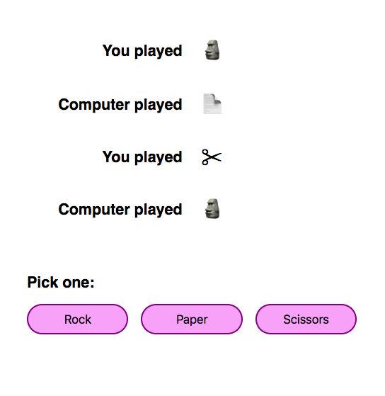
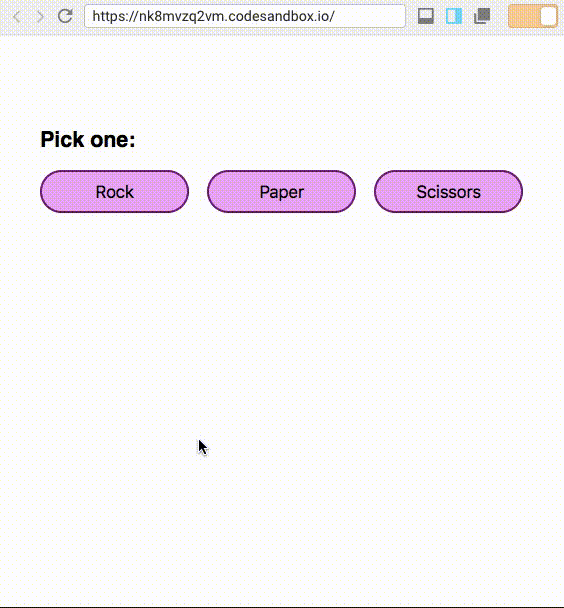
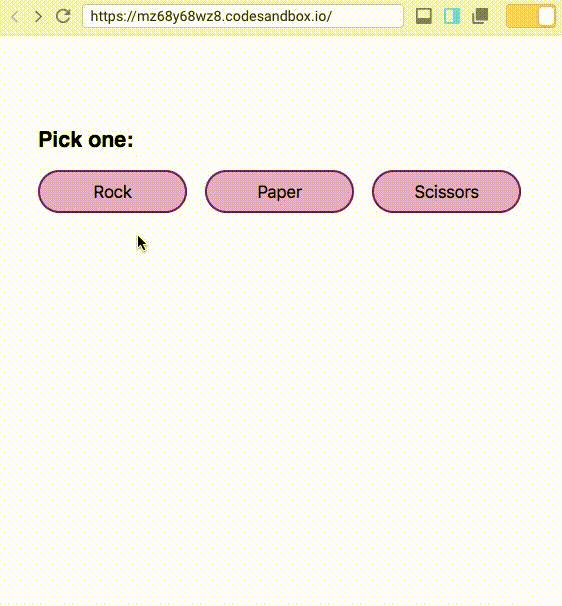

In React, we use the `setState()` function whenever we need to update a component’s internal state. ([Here’s an intro to](https://krithika.dev/build-a-medium-clapper-with-react) <a href="https://krithika.dev/build-a-medium-clapper-with-react" class="fenced-link">state</a>[,](https://krithika.dev/build-a-medium-clapper-with-react) <a href="https://krithika.dev/build-a-medium-clapper-with-react" class="fenced-link">props</a>[, and](https://krithika.dev/build-a-medium-clapper-with-react) <a href="https://krithika.dev/build-a-medium-clapper-with-react" class="fenced-link">setState()</a> [in React.](https://krithika.dev/build-a-medium-clapper-with-react)) But sometimes, `setState()` doesn’t work as expected.

Let’s suppose we’re writing a simple version of a rock-paper-scissors game that looks like this:

<figure>



</figure>

We display each move, attributed either to the player or the computer, and which of the options (rock, paper or scissors) they chose. We can have three buttons that let you choose one of rock, paper or scissors, and play against the computer.

Let us make this app with static data. We initialise a constant named `MOVES`, a list of objects where each object contains a string that defines who played (“You played” or “Computer played”) and the player’s move (“Rock”, “Paper” or “Scissors”), and we display this data in our `render()` method.

<iframe src="https://codesandbox.io/embed/rock-paper-scissors-1-dzy3h" width="1032" height="1200" frameborder="0" scrolling="no"></iframe>

Right now, clicking the buttons doesn’t do anything. To make the app work, we can add our `moves` to `state`, and change `moves` dynamically when any of the buttons are clicked. When a button is clicked, we ought to:

1.  add the user’s choice to the `moves`
2.  find the computer’s move using a random generator
3.  add the computer’s move to the `moves`

Let’s initialise our `moves` in `state` as an empty list. When the user clicks a buttons, we call a function named `playerMove()` that adds the user’s move to `moves` using a `setState()` call.

Then we call `computerMove()` that generates the computer’s move at random and adds it to moves using a `setState()` call.

<iframe src="https://codesandbox.io/embed/rock-paper-scissors-2-wn3og" width="1032" height="1200" frameborder="0" scrolling="no"></iframe>

But it doesn’t work! Let’s take a closer look at what happens:

<figure>



</figure>

It ought to show the player’s move followed by the computer’s move, but only the computer’s move is visible. It seems as though the player’s move is overwritten by the computer’s move.

If we add a `console.log()` to print the value of `this.state` in both the functions, we see that `this.state` still has its old value when we add the computer’s move.

Why is this happening?

What we see above is not an unusual bug, it’s a direct effect of the way `setState()` works. `setState()` internally works by merging the object passed to it to the current state. `setState()` takes an object as a parameter and merges it with the current state. But here’s the catch:

> React may batch multiple `setState()` calls into a single update for performance.

This means that when we call `setState()` multiple times, like in our example, both the objects from those are merged into state at once.

What does this mean in our example? Let us assume that we start with an empty list, and the player clicks the rock button. In `playerMove()`, we have:

```js
this.setState({  
  moves: [  
    ...this.state.moves,  
    {  
      playedBy: “You played”,  
      option: chosenOption  
    }  
  ]  
)}
```

Because `this.state.moves` is empty and spreading an empty list returns nothing, the `setState()` in the `playerMove()` function looks like this:

```js
this.setState({  
  moves: [  
    {  
      playedBy: “You played”,  
      option: chosenOption  
    }  
  ]  
)}
```

And assuming our next `setState()` is going to get batched with this one, in `computerMove()`, `this.state.moves` is still empty, and the `setState()` looks like this:

```js
this.setState({  
  moves: [  
    {  
      playedBy: “Computer played”,  
      option: chosenOption  
    }  
  ]  
)}
```

When the two objects passed to the two `setState()`s above are merged into state, there are two objects with the same key, `moves`. The key `moves` in the returned object will have the value of `moves` in the last object, which is how we end up with only the computer’s move.

How do we solve this?

Enter `setState()` that takes an updater function, or [functional](https://medium.freecodecamp.org/functional-setstate-is-the-future-of-react-374f30401b6b) <a href="https://medium.freecodecamp.org/functional-setstate-is-the-future-of-react-374f30401b6b" class="fenced-link">setState()</a>. Functional `setState()` takes an updater function as a parameter: the updater takes the previous state and the current props as parameters, and returns an object that will then be merged with state. Like this:

```js
this.setState((state, props) => ({  
  moves: [  
    ...state.moves,  
    {  
      playedBy: “You played”,  
      option: chosenOption  
    }  
  ]  
}));
```

Here’s our rock paper scissors game rewritten using functional `setState()`:

<iframe src="https://codesandbox.io/embed/rock-paper-scissors-3-5m3jv" width="1032" height="1200" frameborder="0" scrolling="no"></iframe>

<figure>



</figure>

Now the player’s move and the computer’s move are both visible! This solves our problem because when functional `setState()` is called multiple times, the functions are guaranteed to execute in order.

<blockquote class="twitter-tweet" data-lang="en"><p lang="en" dir="ltr">It is safe to call setState with a function multiple times. Updates will be queued and later executed in the order they were called. <a href="https://t.co/xNr6EDVdJv">pic.twitter.com/xNr6EDVdJv</a></p>&mdash; Dan Abramov (@dan_abramov) <a href="https://twitter.com/dan_abramov/status/824309659775467527?ref_src=twsrc%5Etfw">January 25, 2017</a></blockquote>
<script async src="https://platform.twitter.com/widgets.js" charset="utf-8"></script>


Sometimes, we calculate current state based on previous state, for instance,

1.  if we have to add or remove elements to an array in state
2.  if we have to concatenate to a string in state
3.  if we increment a number in state

Whenever state needs to be calculated based on a previous state, it’s unsafe to pass an object to `setState()`. Because `this.state` is updated asynchronously, and changes to state can’t be expected to immediately reflect in `this.state`, `this.state` can’t be used to calculate the next state.

This is why the recommendation is that when we calculate state based on previous state, and we require that the state updates execute in order, we should use functional `setState()`.
