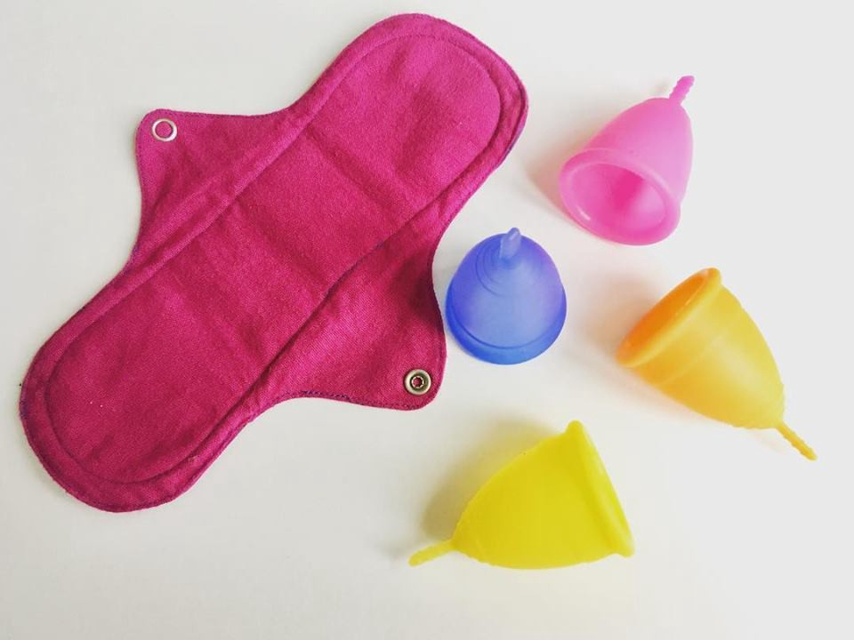

I’ve always been one to do my bit about the environment, even though I’m sometimes starkly aware that the impact I have from carrying my own cloth bag is probably less than a drop in the metaphorical ocean. I went far enough to start using neem twigs instead of toothbrushes for three years! (Unfortunately, I had to stop, after a visit to my dentist who told me that she was fine with me chewing on a neem twig every morning, just as long as I also used a toothpaste and a toothbrush.)

When I was 17 I saw a small article in The Hindu, addressing sanitary waste. It brought up that sanitary waste is non-biodegradable and that there’s actually alternatives to it! This article first introduced me to the concept of cloth pads and menstrual cups.

<figure>

</figure>

I was immediately dismissive of cloth pads, because I’ve heard my mum saying she used to use cloth instead of a sanitary pad, and that it’d leak so much and that sanitary pads were a godsend. But a menstrual cup! It’s a cup made of silicone that goes inside your vagina that just collects all your blood, as opposed to absorbing it! And it’s reusable! This definitely piqued my interest.

However, my mum was staunchly against menstrual cups. She would never tell me why. It seemed like this irrational fear of anything that goes in my vagina. Nothing seemed to make my mum consider menstrual cups, not even the fact that the article was published in The Hindu, which she usually considers a trusted source.

In an effort to be eco friendly, I started looking up cloth pads. Cloth pads seemed really cool! They don’t have an adhesive layer, but they stay put because of their cute little wings that fastened together. I found a few on Eco Femme, and they came with three to nine layers of cotton flannel for light to heavy flow. They even had a back layer made of leakproof PUL that keeps the blood from getting into my underwear! My mum was not anti cloth pads, and I got myself six cloth pads, and this led to a better menstrual experience.

People are probably familiar with the annoying feeling of pulling a used sanitary napkin off the underwear, a feeling I was glad to be rid of. As soon as I switched to cloth pads, I stopped getting rashes, and I no longer had to deal with getting the wings stuck to my pad (far too many times). The major con of a cloth pad was that I needed to wash them! But the Eco Femme website explained that I could just soak my cloth pad for half an hour (I’d just soak them overnight though), and most of the blood would just get in the water. After that, I merely had to wash it with soap and rinse it. If I had a choice, I wouldn’t be washing my pads when I’m menstruating (and tired), but despite my tiredness, I enjoyed washing my cloth pads. I was almost always amazed at the rich red colour the water would get after having my pads soaked in it.

I used cloth pads for a year. In this year I read up a lot about menstrual cups, and I kept trying to convince my mum about them. But the things I’d learnt from my research fell on deaf ears as my mum stubbornly refused to listen to anything I had to say about menstrual cups.

I eventually got myself a menstrual cup despite my mum’s opposition, and I could say that it was because I’d decided that I did not need anyone else’s approval to decide how I manage my menstrual flow. But the truth is that I’m an extremely stingy person. I’d worn out all my cloth pads by scrubbing them too hard, and it was time for me to buy a new set. At ~200 a pad, six pads cost more than how much a menstrual cup would cost, and this lead to my decision to get myself a menstrual cup.

I’ve been using my menstrual cup for two years now, and it’s been such a great experience! I no longer have to wash my cloth pads when I’m menstruating! All I need to do is insert my cup, let it collect my blood, and remove, wash and reinsert every 12 hours. And the best part is that I don’t feel anything at all! When I used pads, I’d be aware of the blood flow out of my vagina, but since a menstrual cup collects the blood, I don’t even feel that anymore! I sometimes even forget that I’m on my period, only to be reminded again because of my menstrual cramps.

If you’re considering doing your bit for the environment, or just switching to a more comfortable way of managing your menstruation, I definitely recommend getting a menstrual cup!
