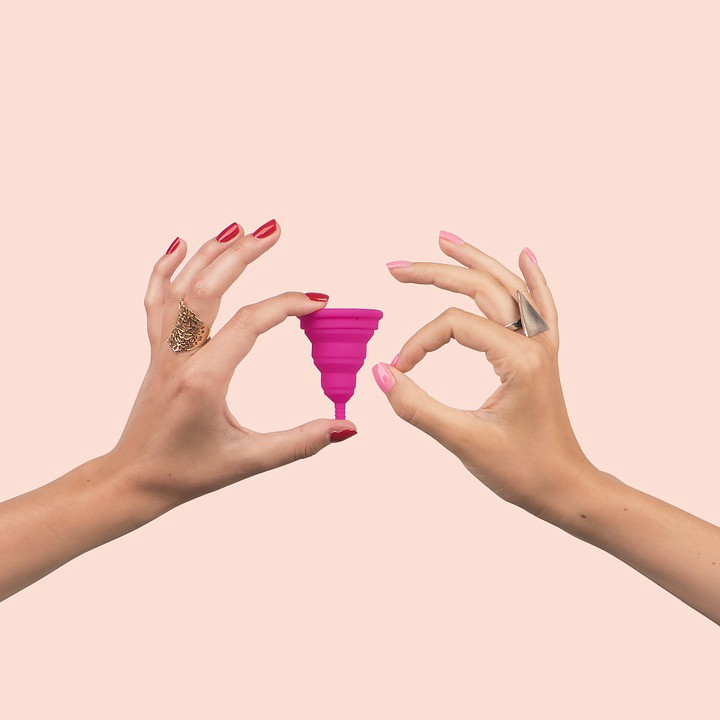

Ever since I wrote about [alternatives to sanitary napkins](https://krithika.dev/an-alternative-to-sanitary-napkins), people have been telling me about their concerns about using a menstrual cup. I’m writing this post to debunk a few common myths about the menstrual cup.

<figure>

</figure>

### Insertion is painful

It’s true that inserting a menstrual cup for the first time will probably not be easy, but it’s never supposed to be painful. If you’re in pain when trying to insert a menstrual cup, stop immediately, and definitely don’t try to force it in.

Most women experience difficulty when first inserting a menstrual cup solely because their muscles are tensed. I get it, it’s a new experience, and we tend to clench. But if you clench your muscles that’s not gonna help! The first time I attempted to insert my menstrual cup, I got discouraged because it wouldn’t go in at all. I started looking at forums for insertion help, and a woman told me to relax. “[Relax](https://www.reddit.com/r/menstrualcups/comments/3zx3ez/menstrual_cup_insertion/?depth=1)” [is a](https://menstrual-cups.livejournal.com/3178830.html) [mantra](https://www.reddit.com/r/menstrualcups/comments/7m7kws/got_my_first_cup_but_couldnt_get_it_in_should_i/?depth=1) [in](https://menstrual-cups.livejournal.com/929364.html?thread=9630548#t9630548) [menstrual](https://divacup.com/okay-so-i-bought-the-divacup-now-what/) [cup](https://www.organicup.com/how-to-use-a-menstrual-cup/) [websites](https://www.lunette.com/pages/teens-menstrual-cups) [and](https://www.reddit.com/r/menstrualcups/comments/4e2hon/tentatively_optimistic/?depth=1) [forums](https://www.reddit.com/r/menstrualcups/comments/b1ycl0/second_cycle_with_cupi_cant_insert_it/?depth=1), and for good reason, (because clenching is what makes it impossible to insert a menstrual cup). I was skeptical about relaxing, but I listened to her anyway. She said, relax your face muscles, and I did, and when I inserted my menstrual cup, it went straight in!

There are two other reasons you may feel discomfort while inserting a cup: you might be getting the angle wrong (see the section **Is there enough space?**) or you might be poking straight at your hymen (see the section **The Hymen**). In both cases you need to try from a different angle.

There are several [menstrual cup folds](https://www.youtube.com/watch?v=lwnK8J8fQxk) that are used to make the entrance of the cup narrow, to make insertion easier. I think the most popular fold is the C Fold, because it even came in my menstrual cup’s manual. My favourite fold is the [origami fold](https://www.youtube.com/watch?v=ExE0S4woWos) which makes the cup have a point and insertion super easy. After insertion, I rotate the cup a little till it “pops” into place. I make it a point to run a finger around the cup so that I know that it’s properly in place. If it feels circular, that means the cup is in properly. If it’s got a dent in the middle, that probably means the cup didn’t unfold and pop.

### Is there enough space?

I feel like the people who ask me this question have never felt their vagina. I think it’s important to insert a finger into your vagina, not because it’s pleasurable (it is), but because there’s no better way to learn about your vagina than to actually feel it yourself! You’ll notice that there’s more than enough space for a menstrual cup. Another thing people are surprised by is the angle of the vaginal canal: It doesn’t go straight up, it’s actually angled towards your tailbone. Getting a feel for all of this surely helps with being more confident while inserting your menstrual cup!

### The Hymen

Ugh, where do I start about this. People are fed the myth that The Hymen is a wall obstructing the vaginal entrance that can only be broken by The Penis. This myth is so widespread that _gynaecologists_ in Rajasthan still perform “virginity tests” in which they determine whether a woman is a virgin based on whether their “hymen” is “intact”, and these tests are even used as grounds for divorce! It’s crazy that the doctors who specialise in women’s reproductive systems still participate in the propagation of such harmful myths!

Here’s a question, you guys, if there was really A Wall Obstructing The Vaginal Entrance, where do you think you’re bleeding from?

I don’t know where this myth even came from. It’s as if a doctor noticed a normal hymen and concluded that if there’s a hole here, it can only be made by The Penis.

Well the truth is, while women do have hymens, they come in several shapes and sizes. In most women it is observed that the hymen only covers a small part of the vaginal entrance, and gently moves out of the way when trying to insert a finger. In my case, there’s a small membrane at the back of my vaginal entrance.

People have all sorts of different hymens, but a small portion (estimated 1 in 200) of the population does have a hymen that mostly covers their vaginal entrance. If you find that your hymen that covers most of your vaginal entrance and does not move out of the way, insertion of any kind will be difficult. If that is the case, then please don’t try to break it with The Penis! It’s better to go to a doctor and get a hymenectomy done.

A myth that goes closely with the myth of the hymen is that sexual intercourse is supposed to hurt the first time, and that women bleed. [All of this is false!](https://www.psychologytoday.com/us/blog/all-about-sex/201103/the-hymen-membrane-widely-misunderstood) Sex is _not_ supposed to hurt. There are women who assume that sex the first time leads to pain and bleeding, and put up with painful sex! If you’re hurting when you have sex, something is wrong!

[Here](https://www.psychologytoday.com/us/blog/all-about-sex/201103/the-hymen-membrane-widely-misunderstood)’s a psychology today article that dissects this myth in detail.

### What If It Gets Lost Inside You

Anatomy lesson: Above your vaginal canal is the cervix, which is an entrance to the uterus. There’s no way for a menstrual cup to go up the uterus because the cervix is blocking the path. However, some women have a high cervix, and it’s best to measure how far away your cervix is before you buy a menstrual cup. If your cervix is too high, it’s best to get a menstrual cup with a stem that you can hold on to while you reach for the cup. If your cervix is too low, then a stemmed menstrual cup can poke out of your vagina and cause discomfort, and it’s best to use a menstrual cup without a stem.

After insertion, the menstrual cup will form a seal around your vaginal canal, and to remove it, you can press the cup from any side to remove the seal. Once it gets unsealed, you can easily use a finger and a thumb to remove the cup.

### It Only Works For White People

This sounds so crazy that I can’t believe I’ve actually heard someone say this. Let me clarify just in case, white people do _not_ have a different anatomy than us. In any case, this argument led me to find the Facebook group “[Sustainable Menstruation India](https://facebook.com/groups/1542209039334590)”, which is a group for Indian women who use menstrual cups and cloth pads. I’m glad I found this community of people to talk to, and I enjoy visiting this group, to encourage and help out new menstrual cup users and feel happy for them.

### Can I pee when I’m wearing a menstrual cup?

Anatomy lesson: Your urethra and vagina are different! Wearing a menstrual cup in your vagina does not impact your ability to pee.
