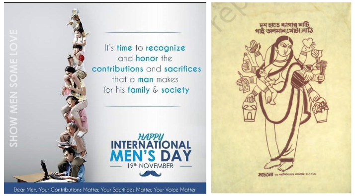

I saw a picture on men’s day.

It showed a man working on a computer, and on his shoulders he’s supporting his father, his mother, his wife, his children, and his pets. It’s supposed to celebrate the men that financially support their entire family.

I find the picture extremely depressing, I see a man that’s burdened with supporting his dependents. He looks like he can barely move. He probably works long hours, and you can probably assume he can’t take any risks in his career, and is probably stuck for life.

I feel similarly depressed when I see a few women’s day posters. There’s one that depicts a woman as a Hindu goddess, with multiple hands, holding a different item in each hand, holding a child in one, a broom in another, a bucket of clothes in another, etc.

<figure>

<figcaption>
It’s interesting that pictures depicting women as goddesses that were originally used by protestors to draw attention to their plight are now used in a celebratory manner.
</figcaption></figure>

I find this even more depressing, honestly, because household work that women do is often considered “not real work”, and they don’t even get paid for it.

It seems messed up to me that we depict these problems in a celebratory manner. Perhaps these posters exist to draw attention to the problems that men and women face, but they come across as telling young men and women that to be real men and women, they must be okay with burdening themselves and sacrificing themselves.

It is possible for people to reduce the amount of pain they are in, but with such social messaging, people are more likely to just accept their suffering as a normal part of life. It is only when we realise that sacrifice and burden are not “normal” and “necessary” that we can start questioning the status quo and making our lives more comfortable.
