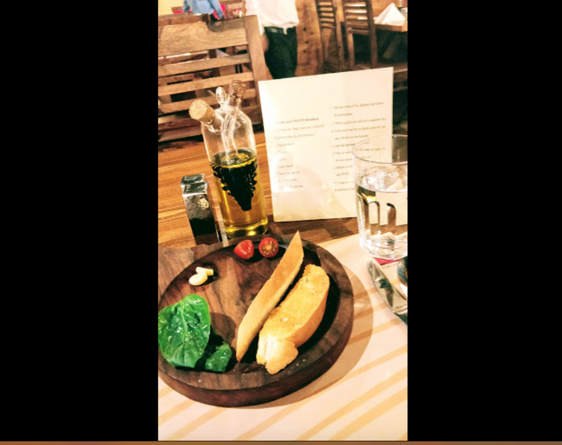
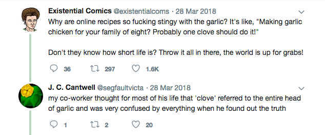
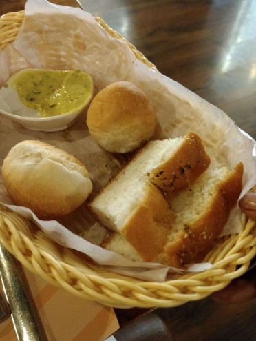

When a friend of mine came back from Germany, where he’d spent six months, he told me that there were so many kinds of bread that if he ate a different kind of bread every day for six months, he still wouldn’t have been able to taste them all. This sounded really exciting to me, because all I’ve ever eaten is the same kind of sliced white bread, or wheat bread, or sweet bread that I get at the supermarket, which all taste pretty much the same.

But a few days ago, I went to this Italian restaurant called Chianti, where we were served a ‘make your own bruschetta’ platter, with crispy baguettes, a few cloves of garlic, basil leaves, and cherry tomatoes.

<figure>

</figure>

On the table, there were salt and pepper shakers, and a cool glass container that contained both olive oil and balsamic vinegar. The glass bottle had two containers and two necks, one that connect to an internal glass container that was shaped like a bunch of grapes, and the external glass container that held olive oil.

The baguette platter came with instructions:

The first step was to take a clove of garlic and rub it on the bread. Being the kind of person that doubles or triples the recommended amount of garlic for every recipe, I was incredulous of this instruction. How is rubbing a piece of garlic on the bread going to transfer any flavour?

<figure>

<figcaption>I love garlic</figcaption></figure>

But when I decided to try out what the instructions said and rubbed the garlic on the bread, the bread was so crispy that the piece of garlic completely disintegrated!

The next step was to fold a piece of basil into as tiny a piece as possible, and rub it all over the piece of bread. The leaf didn’t completely disintegrate like the piece of garlic did, but it tore into tiny shreds all over the bread.

The next step was to sprinkle some salt and pepper and some olive oil. I got over-excited at getting to use the olive oil container and sprinkled a little too much olive oil.

The next step said, “Now take a slice of tomato and… you know what to do by now.” I gingerly rubbed the tomato over the bread, because I don’t really like the taste of raw tomatoes. I didn’t check whether the tomato disintegrated.

I took a bite into the garlicky crispy goodness. I loved how garlicky it was! To my surprise, the basil tasted pretty similar to Tulsi. Even though I knew that Tulsi is also called the Holy Basil, I’ve seen a couple of chefs on TV shows being very particular about not substituting basil with Tulsi, so the similarity in taste was a little surprising to me. I also liked the taste of cherry tomatoes — they seem more sweet than the tomatoes I’m used to. The bruschetta was great!

Later we ordered ravioli, and with the ravioli, they gave us a bread basket!! The bread basket had some really soft slices of bread, and they came with a spread(dip?) made of butter and herbs. The delicious salty spread was great on the soft sweet bread. I ended up eating more bread than ravioli.

<figure>

<figcaption>The bread basket. The basket looks really pretty too!</figcaption></figure>

Chianti is a great restaurant to try out, if only for its great bread.
